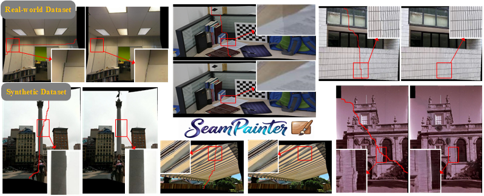

# SeamPainter: Learning to Paint around Cutting Seam for Image Stitching
<p align="center">
  <a href="assets/first.pdf">
    
  </a>
</p>

SeamPainter takes a seam-cutting result, an expanded seam mask, and an expanded
seam-quality mask as input, then generates the refined stitching result.

## Installation

Python 3.10 or 3.11 is recommended. Install a CUDA-compatible PyTorch build
first. The Qwen-Image and FLUX.2 implementations use different DiffSynth
versions and should be installed in separate environments.

Qwen-Image environment:

```bash
git clone <repository-url>
cd SeamPainter
pip install -r requirements.txt
```

FLUX.2 environment:

```bash
pip install -r requirements-flux2.txt
```

## Model

The Qwen-Image SeamPainter checkpoint is available at [Baidu Netdisk](https://pan.baidu.com/s/1QUX6AOGSbLbZpXK6TD_g_w?pwd=q95b). Extraction code: `q95b`.

The FLUX.2 SeamPainter LoRA checkpoint is available at [Baidu Netdisk](https://pan.baidu.com/s/1RhONjZq0dyRbnsFTx22kCg?pwd=g6sx). Extraction code: `g6sx`.

## Dataset

The SeamPainter dataset is available at [Baidu Netdisk](https://pan.baidu.com/s/1Yq3gWj8W1MC3iw1Ww_BRTQ?pwd=c21y). Extraction code: `c21y`.

## Inference

Each example contains:

```text
sample_xxx/
├── stitched_result.jpg
├── seam_mask.jpg
└── seam_quality_mask.jpg
```

Qwen-Image: set `LORA_PATH` in `scripts/run_examples.sh`, then run:

```bash
bash scripts/run_examples.sh
```

FLUX.2: set `LORA_PATH` in `scripts/run_flux2_examples.sh`, then run:

```bash
bash scripts/run_flux2_examples.sh
```

Results are saved in `outputs/` and `outputs_flux2/`, respectively.

## Training

Qwen-Image:

```bash
bash scripts/train_lora.sh
```

FLUX.2:

```bash
bash scripts/train_flux2_lora.sh
```

Set the dataset and output paths at the top of the corresponding script.

## Data preparation

### Training data

Synthetic training-data generation is provided in
[`data_generation/synthetic/`](data_generation/synthetic/). Seam-cutting code
for producing training templates is provided in
[`data_generation/seam_cutting/`](data_generation/seam_cutting/). See
[`data_generation/README.md`](data_generation/README.md) for details.

### Inference inputs

Code for expanding the seam mask and estimating the seam-quality mask is
provided in [`tools/prepare_inputs/`](tools/prepare_inputs/). The samples in
`examples/` are already prepared and can be used directly for inference.

## Acknowledgements

This project is built with
[DiffSynth-Studio](https://github.com/modelscope/DiffSynth-Studio), Qwen-Image,
and Qwen-Image Blockwise ControlNet Inpaint.
The FLUX.2 implementation uses FLUX.2 Klein through DiffSynth-Studio.

